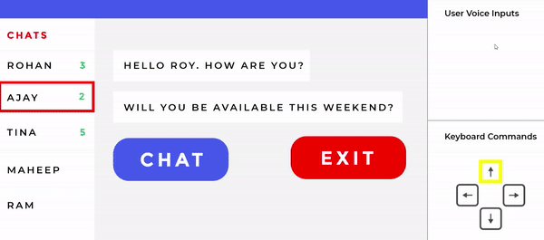

# Python-chat-app

An application which enables Visually Imapired people to communicate (Chat).  
It uses a client to client communication model.  
Initially when the user opens the application, the interface reads out  all the steps, for eg:
  
**System :** Please say Yes to open and No to continue.   
**System:** You have got 5 notifications. Would you like to check those?  
**User:** NO  
**System:** You have received 3 message form Mr.Roy. Would you like to read the messages?  
**User:** YES  
**System:** Mr. Roy says...Hello Raj. How are you? DO you mind meeting us today?  
**System:** If you wish to reply to these messages, please say "REPLY" and to end your message say "X-E-N-D-X". Say "CONFIRM" to confirm the message drafted and "SEND"  to send the message.  
  
The sender's speech is converted to text and can be sent by either a voice command or pressing a button which is arranged in a user friendly way.  
At the receiver's end the received message is converted to speech that the user listens to.  
Thus this technology easily enables Visually Impaired people to chat.  
Following is a preview of how the system works:
 
